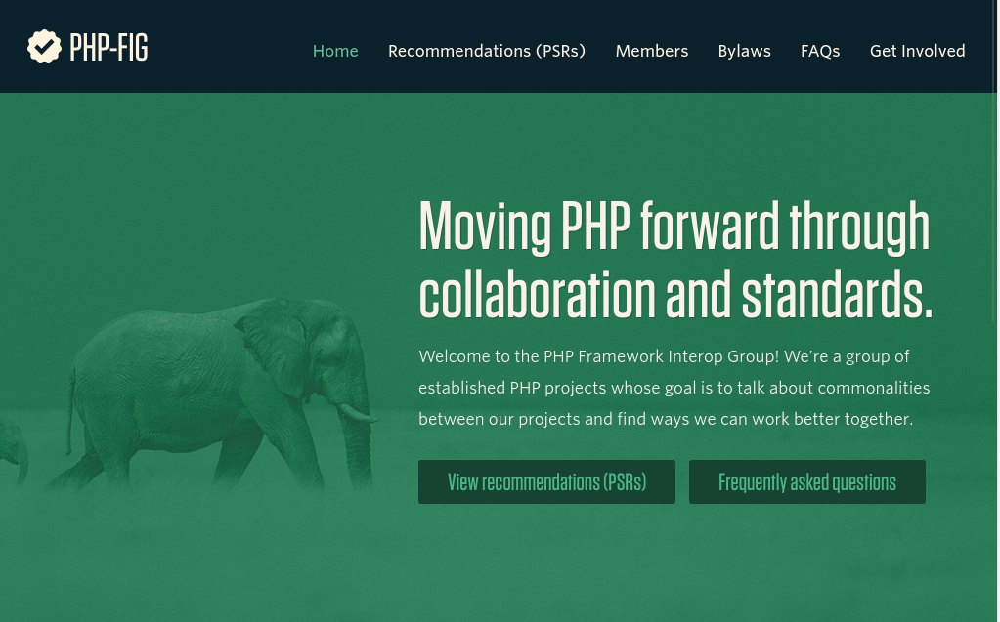
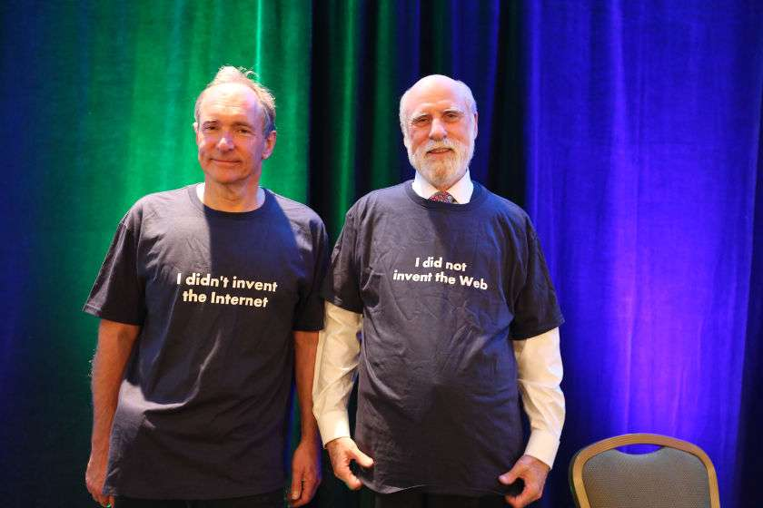

% 01.Introduction aux frameworks PHP

# Développement web dlm3

## Introduction aux frameworks PHP{.title}

<footer>HE-Arc 2016/17 DGR et YBL</footer>

---

# Frameworks PHP

* Lesquels connaissez-vous?
* Lesquels avez-vous utilisé?
* Pourquoi y en a-t-il tant?

<div class=notes>
L'explication donnée par Joe Gregorio pour [le langage
Python](http://bitworking.org/news/Why_so_many_Python_web_frameworks) est : «
parce que c'est facile. »

Dans les faits, cela montre également une maturité de la plateforme.
</div>

---

> _There are people who actually like programming.
> I don't understand why they like programming._
> Rasmus Lerdorf [💬](https://en.wikiquote.org/wiki/Rasmus_Lerdorf)

---

 * PHP-FI _Forms Interpreter_
 * PHP 3, réécrit en C++
 * PHP 4 _Zend Engine_, fausse POO
 * PHP 5, vraie POO
 * PHP 5.1, PDO
 * PHP 5.2, JSON
 * PHP 5.3, `goto` et `namespace`
 * PHP 5.4, `[]` et `trait`
 * PHP 5.5, `yield`
 * ~~PHP 6, Unicode~~ 💩, 🎃, 🐧
 * PHP 7, que du rêve!

<div class="notes">

Il y a plus de vingt ans, Rasmus Lerdorf bricola un outil pour savoir qui
consultait son CV.

Zend, c'est à dire _ZEev_ et _aNDi_, ont réécrit PHP et qui
allait devenir PHP 3 le précurseur du langage de prédilection pour créer sur le
web.

PHP a évolué depuis pour devenir ce qu'il est aujourd'hui. Sa popularité est
liée au fait qu'il est simple à mettre en œuvre, gratuit **et** libre. Tout
un tas de modules est fourni avec pour faire de l'imagerie, des bases de
données, du XML, etc.

Et plus encore sur la page [History of
PHP](http://php.net/manual/en/history.php.php) et [Wikipedia:
PHP](https://en.wikipedia.org/wiki/PHP).

Les différentes moutures de PHP 7 offrent ceci, entre autres.

* PHP 7, performances
* PHP 7.1, `void`
* PHP 7.2, sodium
</div>

---



<div class="notes">
L'évolution de PHP a fait que les usagers du langage, créateur de _frameworks_,
d'outils (comme [_Composer_][4]), ont senti le besoin d'émettre des recommendations
afin d'aller vers un plus interopérable.

Durant ce cours, nous allons vous embêter avec PSR-1, PSR-2 et PSR-4.
</div>

---

# Quiz

Qui est qui?

---

](img/GandalfStaff5.jpg)


<div class="notes">
oOops, ceci n'a rien à voir avec le cours.
</div>

---

[@w3c:20]

<div class="notes">
Donc, ce ne sont pas Gandalf (sans sa barbe) et Saruman mais bien Sir Tim
Berners-Lee et Vinton Cerf, responsables du (World Wide) Web et de
l'Internet.
</div>

---

## Qu'est-ce qu'[Internet](https://www.youtube.com/watch?v=iDbyYGrswtg)?

* un réseau IP

---

## Qu'est-ce que le [World Wide Web](http://line-mode.cern.ch/www/hypertext/WWW/TheProject.html)?

* **URI/URL**, des identifiants uniques
* **HTML**, un langage de publication
* **HTTP**, un protocole d'échange de texte (ou _HyperText_)

---

# Préparatifs

[https://github.com/HE-Arc/php-intro-framework/][8]

<div class="notes">
```shell
$ sudo systemctl start httpd
$ cd /var/www/html
$ git clone \
> https://github.com/\
> HE-Arc/php-intro-framework

$ cd php-intro-framework
$ open http://localhost/php-intro-framework
```

Les exemples suivant travaillent sur le code disponible dans le dépôt
[HE-Arc/php-intro-framework][8].
</div>

---

```console

$ curl -v "http://he-arc.ch/?id=25"
> GET /?id=25 HTTP/1.1
> Host: he-arc.ch
>
< HTTP/1.1 200 OK
< Content-Type: text/html; charset=utf-8
<
```

```html
<!DOCTYPE html>
<title>He-Arc</title>
<p>Hello
```

<div class="notes">
HTTP est un protocole texte plutôt simple, jugez plutôt:

Ce que nous voyons est une connexion TCP/IP au serveur `he-arc.ch`.
Une fois la connexion établie, il envoie en texte ASCII les entêtes HTTP puis
deux retours à la ligne (ce qui correspond à une ligne vide). La requête HTTP
commencent toujours par la demande, ici `GET /index.php?page=equipe&id=25
HTTP/1.1` puis les entêtes, ici: `Host: www.he-arc.ch`. La réponse du serveur
est du même type, le code de réponse (`HTTP/1.1 200 OK`), les entêtes, une ligne
vide puis le contenu.

La demande et les entêtes sont en US-ASCII mais le corps peut être encodé
autrement, ici c'est dit dans l'entête `Content-Type: text/html; charset=utf-8`.
</div>

---

## Fait #1


PHP parle HTTP.

<div class="notes">
Le fichier `index.php` est le code PHP le plus simple qui soit. Simple au sens
du niveau de compréhension de PHP et d'une forme de complexité.

```php
<?php // 00-base

// Lecture de la query string `page=<XX>&id=<YY>`.
$page = isset($_GET["page"]) ? $_GET["page"] : null;
$id = isset($_GET["id"]) ? (int) $_GET["id"] : 0;

// Connexion à la page de donnée.
$db = new PDO("sqlite:../users.db");

// Page HTML
?>
<!DOCTYPE html>
<meta charset=utf-8>
<title>He-Arc</title>
<?php
// Contenu
if ("equipe" === $page):
    $query = $db->query("SELECT * FROM `personnes` WHERE `id` = :id;");
    $query->execute(compact('id'));

    $personne = $query->fetch(PDO::FETCH_OBJ);
?>
    <p><a href="<?php echo $_SERVER["PHP_SELF"] ?>">retour</a>
    <h1>Équipe</h1>
    <h2>
        <?php echo $personne->prenom ?>
        <?php echo $personne->nom ?>
    </h2>
    <p>
        email));
        ?>" alt="avatar">
<?php
else:
?>
    <h1>Accueil</h1>
    <ul>
        <li><a href="?page=equipe&amp;id=1">Yoan Blanc</a>
        <li><a href="?page=equipe&amp;id=2">Yoan Blanc</a>
    </ul>
<?php
endif
```

</div>

---

## Fait #2

PHP **est** un langage de template.


<div class="notes">
Pour preuve, il faut ouvrir une balise `<?php` pour commencer la partie code.

Avec la pratique, on a réalisé que de mélanger la logique métier et celle
d'affichage n'était pas optimale car difficile à lire et maintenir.
</div>

---

# Séparation métier/affichage

```php
<?php // 01-includes/index.php

// ...

include "templates/entete.html";

if ("equipe" === $_GET["page"]) {
    // SELECT FROM u WHERE id=$_GET["id"]
    // ...
    include "templates/equipe.html";
} else {
    // ...
    include "templates/accueil.html";
}
```

---


<div class="notes">
Quel est le problème avec cette solution?

([Source de l'image](https://raw.githubusercontent.com/cyrilmanuel/picbot/e6ff24a8bfd7ee9f0514a4fd8f49b1255ef26178/picbot/Images/meme10.jpg))
</div>

---

# Sécurité des templates

* _Principle of Least Privilege_[@wiki:polp]
* Intégration faite par un graphiste, société externe

<div class="notes">
Dans ce le cas présent rien ne nous empêche de mettre de la logique métier dans
nos fichiers de template, car ils sont faits de PHP eux aussi.
</div>

---

```html
{# 02-twig/templates/collaborateur.html #}



<p><a href="?">retour</a>
<h1>Équipe</h1>
<h2>
  {{- personne.prenom -}}
  {{ personne.nom -}}
</h2>
<p>

```

<div class="notes">
La page est réalisée avec [Twig](http://twig.sensiolabs.org/).

Le code est un poil plus propre du côté de nos templates qui ne peuvent plus
exécuter de PHP sauf ce qu'on leur autorise, ici `md5` et `strtolower`. Voir
[`02-twig/index.php`](02-twig/index.php).

```php
<?php // 02-twig

require_once 'Twig/lib/Twig/Autoloader.php';
Twig_Autoloader::register();

// ...

// Configuration de Twig
$loader = new Twig_Loader_FileSystem("templates");
$twig = new Twig_Environment($loader);

// Ajout des filtres md5 et strtolower qui sont les fonctions PHP du même nom.
$twig->addFilter(new Twig_SimpleFilter('strtolower', 'strtolower'));
$twig->addFilter(new Twig_SimpleFilter('md5', 'md5'));

// variable globale
$titre = "He-Arc";

// Contenu
if ("equipe" === $page) {
    // ...
    $personne = // ...

    echo $twig->render("equipe.html", compact("titre", "personne"));
} else {
    $personnes = // ...

    echo $twig->render("accueil.html", compact("titre", "personnes"));
}
```

</div>

---

![2007 © Randall Munroe[@xkcd:327]](img/exploits_of_a_mom.png)
Problème d'injection SQL.

<div class="notes">
Effectuer des requêtes MySQL à la main ou devoir connaitre tous les champs crée
beaucoup de redondance et de failles de sécurité potentielles.


Une solution est d'ajouter une couche d'abstraction qui va cacher la structure
réelle de notre base de données et offrir une interface orientée objet. Un
_Object-Relational Mapping_ ou
ORM[wiki:orm] dans le jargon.
</div>

---

```php

<?php
// Ne dites plus
$query = $db->query(
  "SELECT * FROM `personnes` ".
  "WHERE `id` = :id;"
);
$query->execute(compact('id'));
$personne = $query->fetch(PDO::FETCH_OBJ);

// Mais dites plutôt

//  RedBean
$personne = R::load('personnes', $id);
// ou Doctrine
$personne = $om->find('Personne', $id);
```

---

# _Object-Relational Mapping_

 * [RedBean][3]
 * [Doctrine](http://www.doctrine-project.org/) (ORM, ODM)
 * [Eloquent ORM](http://laravel.com/docs/master/eloquent)
 * [etc.](https://en.wikipedia.org/wiki/List_of_object-relational_mapping_software#PHP)

<div class="notes">
Une bibliothèque qui va créer ce lien entre les mondes objet et relationnel
ou document (généralement MongoDB). Il en existe toute une foule.
</div>

---

```php
<?php // 03-redbean/index.php
require 'RedBean/rb.php';
R::setup("sqlite:../users.db");
// ...
if ("equipe" === $page) {
    $personne = R::load("personnes", $id);
    echo $twig->render(
        "equipe.html",
        compact("titre", "personne")
    );
} else {
    $personnes = R::find("personnes");
    echo $twig->render(
        "accueil.html",
        compact("titre", "personnes")
    );
}
```

---

# URI as UI

Pensez à Wikipedia.

<div class="notes">
Les addresses des pages font partie de l'expérience utilisateur. Un utilisateur
doit être capable d'imaginer le contenu de la page en lisant l'URI.
Certainement, ce que vous faites avant de cliquer sur un lien.
</div>

---

## Comment humaniser ?

```
  /index.php?page=equipe&id=42
```

<div class=notes>
La personne avec l'identifiant `42` aura également un _slug_ unique
créé à partir de son nom, ici `jean-bon`.

La solution à notre problème est de demander au serveur web de réécrire les
URL pour nous.
</div>

---

## Réécriture d'URL (`mod_rewrite`)

```apache
# 04-routes/.htaccess

RewriteEngine on
RewriteBase /php-intro-framework/04-routes/

RewriteCond %{REQUEST_FILENAME} !-f
RewriteCond %{REQUEST_FILENAME} !-d
RewriteRule ^(.*)$ index.php/$1 [L,QSA]
```

<div class="notes">

Apache le fait via
[`mod_rewrite`](https://httpd.apache.org/docs/current/mod/mod_rewrite.html) et
Nginx [`try_files`](http://nginx.org/en/docs/http/ngx_http_core_module.html#try_files).

</div>

---

```php

// 04-routes/index.php

$uri = $_SERVER['REQUEST_URI'],
$matches = [];

preg_match(
    "#^/(?P<page>[^/]+)/(?P<slug>[^/]+)/?#",
    $uri,
    $matches
) or die('Arrrrrgh');

echo call_user_func_array(
    $matches['page'],
    [$matches['slug']]
);
```

<div class="notes">

Le code complet va nettoyer l'URI et définir les fonction correspondant aux
pages possibles.

</div>

---

# _Routing_

Lien entre les adresses (URI) et des actions dans le code.

a.k.a. the _Front Controller_.

<div class="notes">
En pratique, les actions ne sont pas des fonctions mises à plat mais sont
encapsulées dans une classe qu'on nomme un contrôleur. Faire ainsi permet
de regrouper logiquement les fonctions et éviter d'utiliser d'affreux éléments
tel que `global`.
</div>

---

# Modèle - Vue - Contrôleur

 * Modèle: l'ORM qui s'occupe de notre base de données
 * Vue: les templates qui affiche les données
 * Contrôleur: une classe qui définit quoi faire en fonction des entrées
   utilisateur (URI, formulaire, etc.)

<div class="notes">

_MVC_[@wiki:mvc] vient des applications bureau et ne représente pas
toujours le fonctionnement dans le monde du web. Par exemple, Django, un
framework Python, se décrit comme étant _Modèle - Template - Vue_[@django:mtv].

Les frameworks web en PHP (ou d'autres langages) reposent majoritairement sur
ce paradigme-là.
</div>

---

# _Composer_

Gestionnaire de paquets pour PHP: [getcomposer.org][4]

<div class="notes">
Maintenir notre répertoire de _vendor_ ainsi que les `require` est peu pratique.
Voici qu'entre en scène [Composer][4], le gestionnaire de
paquet pour PHP. [Packagist](https://packagist.org/) est le dépôt en ligne de
paquets public et utilisé par défaut.
</div>

---

## `composer.json`


```json
{
    "require": {
        "twig/twig": "1.24.*",
        "gabordemooij/redbean": "4.3.*",
    }
}
```

<div class="notes">
Nos dépendances sont ainsi matérialisées dans le projet et peuvent être
installée, ou mises à jour simplement.

En principe les numéros de version respectent le
[SemVer](http://semver.org/lang/fr/) (_Semantic Versioning_).
</div>

---

```console


$ composer install
```

puis

```php
<?php // 05-composer/index.php

require 'vendor/autoload.php';

use RedBeanPHP\Facade as R;
```

<div class="notes">
Enfin, nous pouvons réduire le nombre de `require` et `include` à un seul,
en laissant soin à l'_auto-loader_ de charger le bon fichier à la demande.
Tout ceci est spécifié dans [PSR-4](http://www.php-fig.org/psr/psr-4/). Ainsi,
les définitions de Twig sont présentes et il nous suffit d'obtenir la classe
`R` depuis [RedBean][3].
</div>

---

# _Front-Controller_

Utilisation de [FastRoute](https://github.com/nikic/FastRoute)<br>
(voir [06-fastroute/index.php](https://github.com/HE-Arc/php-intro-framework/blob/master/06-fastroute/index.php)).

<div class="notes">
```console
$ composer require nikic/fast-route
```

`FastRoute` repose sur un système proche de celui que nous avons utilisé
jusqu'ici. D'autres sytèmes, tels que `Aura.Router` pour ne citer que lui,
reposent sur la spécification [PSR-7](http://www.php-fig.org/psr/psr-7/). Cette
dernière décrit l'interface objet d'un message HTTP, tant au niveau de la
requête que de la réponse.

Si ça ajoute, une bonne couche de complexité, l'énorme avantage offert par
cette idée là est de déléguer le rendu d'une page, ni `echo`, ni `header`, Donc
il est envisageable de pouvoir tester (au sens de test unitaire), notre
_FrontController_.

D'autre part, le `call_user_func_array` d'avant n'était pas très solide,

</div>

---

```php

<?php // 06-fastroute/index.php
// ...
use function FastRoute\simpleDispatcher;
use FastRouter\Dispatcher;

$dispatcher = simpleDispatcher(function($r)
{
    $r->addRoute('GET', '/', 'accueil');

    $r->addRoute(
        'GET',
        '/equipe/{slug}',
        'equipe'
    );
});
```

---

```php
<?php // 06-fastroute/index.php (suite)

$httpMethod = $_SERVER["REQUEST_METHOD"];
$uri = $_SERVER["REQUEST_URI"];

// nettoyage de $uri
// - prefix
// - query string
// - caractères spéciaux (e.g. %20)

$routeInfo = $dispatcher->dispatch(
    $httpMethod,
    $uri
);
```

---

```php
<?php // 06-fastroute (suite)

switch($routeInfo[0]) {
    case Dispatcher::NOT_FOUND:
    case Dispatcher::METHOD_NOT_ALLOWED:
        /* ... */break;
    case Dispatcher::FOUND:
        try {
            echo call_user_func_array(
                $routeInfo[1],
                $routeInfo[2]
            );
        } catch (Exception $e){
            echo server_error($e);
        }
        break;
}
```

---

# _Framework PHP_

Une collection de bibliothèques avec un peu de glue.

<div class="notes">
Un framework web vous propose une structure de base pour construire selon une
méthode jugée bonne par ses concepteurs. Il est possible de remplacer un
composant par un autre, par le sien. Et même de créer sa glue ou même ses
outils propres.
</div>


---

## Liens avec Laravel

* Modèle MVC
* Templates utilisant _blade_.
* ORM nommé _Eloquent_.
* _Front-Controller_ (`Illuminate\Routing`)
* Bibliothèques ... (`Illuminate\*`)
* [Composer][4]

<div class="notes">
Je vous invite à aller lire le code généré pour vous par Laravel. Vous allez
retrouver ces éléments-là. Symfony, CakePHP, etc. auront les mêmes idées.
</div>

---

## Exercice

* Refaites les différentes étapes à partir de `00-base`.
* Tel quel ou en utilisant d'autres bibliothèques :
[Smarty](https://github.com/smarty-php/smarty),
[Doctrine](http://docs.doctrine-project.org/en/latest/tutorials/getting-started.html),
[Aura.Router](https://github.com/auraphp/Aura.Router)

---

# Fin

Questions?

<!-- Bibliographie -->
[3]: http://www.redbeanphp.com/
[4]: http://getcomposer.org/
[8]: https://github.com/HE-Arc/php-intro-framework

<!-- CSS -->
<style>
html, .view body {
    background-color: #CC0050;
}

body {
    box-shadow: 0 0 20px black;
}

section > pre, section > .sourceCode {
    margin: 0 .5em;
}

h4 {
    margin: .5em 1em;
}

p {
    font-size: inherit;
    margin: 1em;
}


blockquote > p {
    margin-top: 0;
    margin-bottom: 20px;
    font-size: 0.8em;
}

#progress-bar {
    height: 5px;
    border-top-right-radius: 10px;
    background: rgba(239, 0, 98, 0.5);
}
</style>
