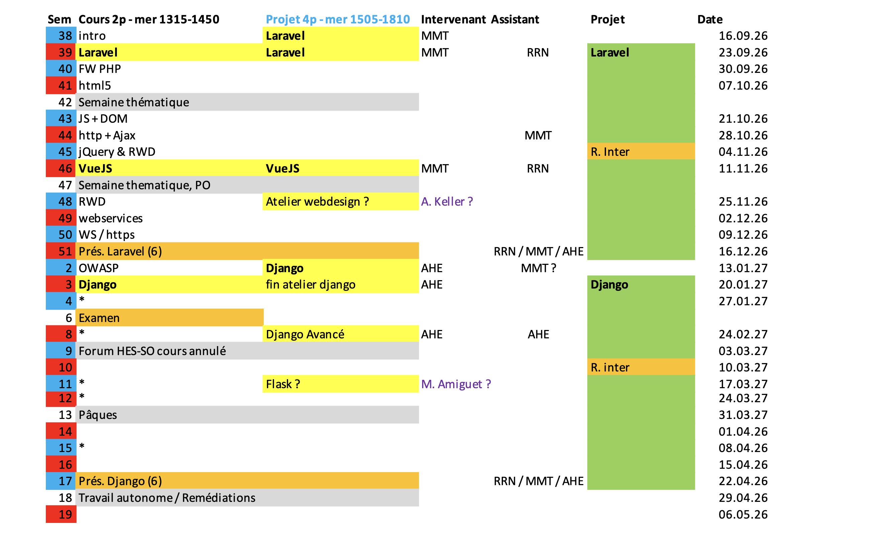

% 01.Cours devweb

# Développement web ISC3-il
## Présentation du cours{.title}
<footer>HE-Arc 2026/27 DGR et YBL</footer>

# Programme
* Frameworks MVC : Laravel, Django, …
* HTML5 : vue d’ensemble
* Javascript : VueJS, Node.js, jQuery, AJAX, JSON, ...
* Déploiement et configuration Serveur
* Webservices (API's) : REST vs SOAP
* Sécurité : Menaces, risques, prévention
* (Responsive) Web Design
* (Syndication : RSS, Atom)
* Vos souhaits ?

# Contenu, activités
* Cours théorique
* 2 Projets
  * frameworks : Laravel, Django, Vue.js (ouvert à d'autres propositions)
  * Groupes de 3, [30h][module] par personne et par projet
  * Présentation de 20min
* Workshops intervenants externes
  * Webdesign ([A. Keller][AK]) ?
  * Flask ([M. Amiguet][MA]) ?
  * Vos présentations ? Vos propositions ?
* Support : [ghpages][slidesghp] ([source][slides]), partage fichiers : [teams][teams]

# Projets
* Faire pour apprendre (⚠️ IAg)
* Les rôles dans une équipe de développement web, workflow
* Ne pas réinventer la roue ou tout faire soi-même
* Critères d’évaluation d’un projet
* En profiter pour apprendre des choses qui vous intéressent
* Avant le 1er octobre :
    * Avoir un compte github avec une [clé SSH][sshkey] (indispensable au déploiement)
    * Constitution des équipes de 3 personnes
    * Choix du projet
    * Forge : Créer projet sur github dans l'entité [HE-Arc][gharc]
    * [S’inscrire][wiki]

# Choix des projets
* Contrainte : appli basée sur des données
* Choix
    * Besoin réel
    * Données existantes :  [dbpedia][dbp], [opendata][odata], …
    * S'inspirer de l'existant :
        - [Product Hunt][prodhunt], Make Use Of [liste 1][makeuseof] , [liste 2][muo2], [PWA Directory][pwadir], …
        - [Volées précédentes][gharc]
* Commencer tôt pour se libérer les dernières semaines de l'année

# Calendrier
|Semaine|Automne|Semaine|Printemps|
|---:|---|---:|---|
|38|Projet PHP|8||
|39||9||
|40||10|Rendu intermédiaire|
|41||11||
|42|S. thématique|12||
|43||13|Pâques|
|44||14|Présentations|
|45|Rendu intermédiaire|16||
|46||17||
|48||18||
|49||19||
|50||20|Début TB|
|51|Présentations|21||
|3|Projet Python|||
|4||||
|5|T. Autonome|||
|6|Examen|||

# Suivi du calendrier (à jour sur [teams][teams])

# Jalons pour chacun des 2 projets
* Echéances
  * En début de semaine, pour chacun des projets :
    1. Formation équipe et choix thème
    2. Objectifs et maquettes
    3. Authentification et 1er déploiement
    4. Modèles avec relations (au moins 3, dont 1 n-n)
    5. 
    6. Rendu intermédiaire (détails dans slides workshop)
    7. 
    8. Minimal Viable Product
    9. 
    10. 
    11. 
    12. Rendu projet, Présentation
* Il n'est pas interdit d'en ajouter

# Conseils
* Le plus simple possible, pas trop de données
* Application crédible (vraies données, cas réalistes)
* Projet à blanc (workshop) pour la prise en main du framework
* [Maquettes][mockups]
* [Organisez][branching] l'utilisation du dépôt
* Le temps disponible à l'horaire ne suffira pas !
* Essayez de commit avec la même identité
* Signalez dans le commit msg si vous n'êtes pas l'auteur
* Le déploiement est long : commencez tôt !
* Il est moins risqué travailler plus au début du projet qu'à la fin !
* Discutez ! Echangez !

# IA Génératives
* Fiche de cours dans Teams
  * Activité non listée ? Doute ? ➡️ On en parle avec le prof
* Doit [favoriser l'apprentissage][aidecisiontree], pas le péjorer
* Intégrité académique et professionel, transparence
* Déclarer (*Disclose*) :
  * Idéalement lien vers la session
  * Outil, modèle, prompts
* Ressources : [SPOC HES-SO][spoc-so], [Postion MIT][AIE-MIT], [Impacts métier probables][ytaipl]

# Évaluation des projets
* Note intermédiaire (1/5 de la note du module, détails dans slides workshop) :
    * 1 page affichage BDD (autre que user)
        * p.ex. : Liste de tous les films
    * 1 page d'enregistrement BDD (autre que user)
        * p.ex. : Création d'un film
    * Respect des conventions et bonnes pratiques
    * Respect du pattern MVC : Les requêtes doivent passer par toutes les étapes importantes de Laravel
        * route, validation des entrées, contrôleur, vue
    * Application déployée avec tous les éléments cités plus haut testable et fonctionnel

# Évaluation des projets - suite
* Note finale (4/5 de la note du module, détails dans slides workshop) :
    * Code : 50%
        * Absence bugs, qualité code, lisibilité, respect conventions et bonnes pratiques
        * Déploiement, configuration
    * User Experience : 30%
        * Design UI, Utilisabilité (Efficacité, efficience, satisfaction)
    * Gestion de projet : 20%
        * Fichiers versionnés, messages de commit, Issues, planification, travail en équipe
        * Documentation (wiki), Investissement, volume de travail
    * Bonus (ceux qui vont plus loin) : 0-20%
        * **Tests**, WebSockets ou autre API HTML5, webservices, …
        * Contribution, présentation, documentation, …
* Tous les membres d'un groupe n'ont pas forcément la même note

# Participation
* Aux projets des autres : Issues, PR
* Participez à la [Hacktoberfest][hacktober]
* Pariticipez au cours : contenu, présentation, pages ([index][ghpindex], [wiki][wikicours], ...)
* Echangez avec [github](https://github.com/HE-Arc/slides-devweb/discussions/58) ou un im (discord, [teams][teams], ...)

# Présentation facultative
* Facultatif, ne peut qu’augmenter la moyenne
* DOIT être annoncé au semestre d'automne
* Un thème absent du cours
* 2 à 4 personnes
* Une présentation claire avec démo (printemps)
* Un exercice d’application
* Critiques et discussion
* Au plus tôt :
    * Constitution des équipes
    * Proposer 1 à 3 thèmes
    * [Proposer][form-pres] le(s) thème(s) de présentation et l'équipe

# Examen oral SA
* Généralités pour la partie dev web de l'examen :
    * Vous n'avez droit à rien : on vous mettra à disposition 1 crayon et du papier pour préparer votre présentation,
    * L'examen porte sur toute la matière vue au en cours (yc workshops),
    * Les questions sont générales, il s'agit de présenter des concepts vus en cours (souvent 1 chapitre), et expliquer certains mécanismes sous-jacents,
    * Il n'agit pas de réciter le contenu des slides par coeur coeur, mais de les présenter avec vos propres mots (compréhension), et vos propres exemples.

# Examen oral SA
* Déroulement : 
    * Vous tirez un n° de question au hasard pour chaque cours 
    * Vous disposez de 15 min pour préparer une présentation de 10 min pour chacun des 2 cours (pendant la présentation de l'étudiant précédent) 
    * Idéalement vous faites une présentation d'environ 10 min et les 5 min restantes sont dédiées aux questions (pour chacun des cours)

# Mon expérience en développement web
* [Questionnaire][form-survey] obligatoire (votre username github vous y sera demandé)

### 🙏 !

<!-- Bibliographie -->
[AK]: https://www.alinekeller.ch
[MA]: http://www.matthieuamiguet.ch/
[RE]: https://www.linkedin.com/in/raphaelemourgeon/
[slidesghp]: https://he-arc.github.io/slides-devweb/
[slides]: https://github.com/HE-Arc/slides-devweb/tree/master/src
[module]: https://rs.he-arc.ch/index.php?id_menu=78&id_parent=76
[sshkey]: https://github.com/settings/keys
[gharc]: https://github.com/HE-Arc/
[dbp]: https://www.dbpedia.org/resources/individual/
[odata]: https://opendata.swiss/fr/
[prodhunt]: https://www.producthunt.com/topics/web-app
[makeuseof]: https://www.makeuseof.com/tag/useful-web-apps/
[muo2]: https://www.makeuseof.com/search/?q=web+app
[pwadir]: https://pwa.directory/categories
[wiki]: https://github.com/HE-Arc/slides-devweb/wiki/Projets-2026-2027
[github]: https://github.com/orgs/HE-Arc
[arcghp]: https://he-arc.github.io
[hacktober]:https://hacktoberfest.digitalocean.com/
[mockups]: https://brainhub.eu/blog/difference-between-wireframe-mockup-prototype/
[branching]: http://drewfradette.ca/a-simpler-successful-git-branching-model/
[form-pres]: https://docs.google.com/spreadsheet/viewform?formkey=dEVJRE1WVTVPelhFcE94TGF5N1c0cGc6MQ
[form-survey]: https://docs.google.com/spreadsheet/viewform?formkey=dDg5Znh5akRBV1hPbC1qYlVRV3BONFE6MQ
[ghpindex]: https://he-arc.github.io/
[wikicours]: https://github.com/HE-Arc/slides-devweb/wiki
[teams]: https://teams.microsoft.com/l/team/19%3ahGPvEcXl8HCohGre1MLq7AQ4qPWNkY_JqMTTPMPLM-I1%40thread.tacv2/conversations?groupId=cadc33cc-9fc8-49d7-b951-aa26d534e15f&tenantId=5b3b7d7d-e119-4d05-9022-f775f2e48e96
[spoc-so]: http://spoc.hes-so.ai/
[AIE-MIT]: https://aiandeducation.mit.edu/report/
[ytaipl]: https://www.youtube.com/playlist?list=PLPlKp7M-XTJw&jct=id40uzluhyjfQ1dLo_rO1w
[aidecisiontree]: https://cat.wfu.edu/resources/ai/syllabus/decision/

<!-- Hack -->

