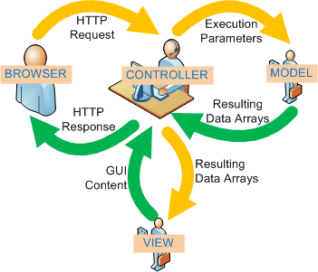
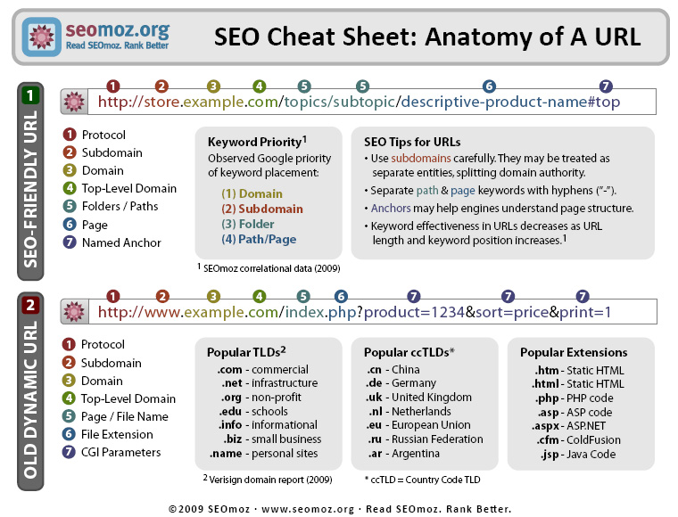
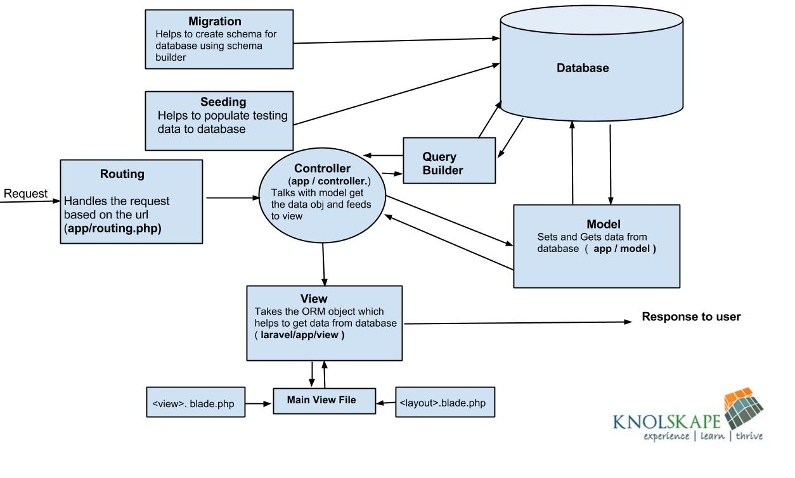

% 02.Frameworks web

## Frameworks web{.title}

<footer>HE-Arc (DGR) 2016</footer>

# [Framework](http://en.wikipedia.org/wiki/Software_framework)

* Fonctionnalités similaires pour de nombreuses applis
* Composants de haut-niveau réutilisables (faible couplage)
* Règles de codage et d’architecture
* Code sûr et efficace
* Facilite les tests et la gestion de projets complexes
* Utilisation de Design Patterns dès que possible
* Comportement par défaut
* Extensible
* Principe d’inversion de contrôle

Différences entre framework et library sur [Stack Overflow](http://stackoverflow.com/questions/148747/what-is-the-difference-between-a-framework-and-a-library) ou [artima developper](http://www.artima.com/forums/flat.jsp?forum=106&thread=152104).

#Design Patterns et webdev

* Inversion de contrôle ([IoC](http://martinfowler.com/bliki/InversionOfControl.html))
* Model View Controller
    * M : Accès aux données, logique métier
    * V : Templates des pages à générer
    * C : Orchestration, transfert des infos
* Front Controller
   * Traitement et dispatch des requêtes
   * (bootstrap, ré-écriture des URL, …)
* [Object Relational Mapping](http://blog.mazenod.fr/2010/01/design-pattern-mvc-zoom-sur-la-couche-modele-dal-dao-orm-crud/)
   * Active Record, Table Data Gateway, Data Mapper, …
* [UI Patterns](http://ui-patterns.com/)

# MVC for webdev



# Conventions

* Nommage
    * Classes
    * Base de données
    * Fichiers et dossiers
* ROUTES : ```http://app.host.tld/controller/action[/key/val]```
* Arborescence :
    * Imposée ou libre selon frameworks
    * Pas de code (minimum) sous la racine web 
* Conventions obligatoires ou non, mais RECOMMANDEES dans tous les cas

# Bonnes pratiques

* Heavy Model, Light Controller
* Don’t Repeat Yourself
* You Ain’t Gonna Need It
* Convention Over Configuration
* Keep It Simple and Stupid

# Pretty ( | smart | clean | formatted) URL

* Les URL doivent être explicites :
    * Manipulées par l’utilisateur
    * Utilisées pour le référencement 
* Cohérence avec l’implémentation MVC :

```
http://app.host.tld/controller/action[/key/val]
```
* Le routage (routing)
    * Le Front Controller recoit toutes les requêtes (URL rewriting)
    * Il les dispatche vers les contrôleurs 

# Smart URL & SEO



# Autres Services

* Migrations : Evolutions de la strucutre de la BDD
* Tests
* Génération, validation et traitement de formulaires
* Authenfication, Sessions, Permissions, Roles, ACL
* Pagination
* I18n
* Génération de code
* Mail
* Connecteurs aux webservices
* Captchas
* Loggers
* ... 

# Exemple d'architecture : Laravel



# Performance

* Un framework web est lent :
    * Rendu d’une page nécéssite de traverser tout le code
    * Pour chaque requête toute l’appli est chargée
    * Plus de code qu’une appli standalone
    * Plus de requêtes
* Solutions
    * Cache de pages, d’opcode
    * Jointures ORM, vues, procédures stockées
    * Outils d’optimisation : YSlow, page speed, mytop
