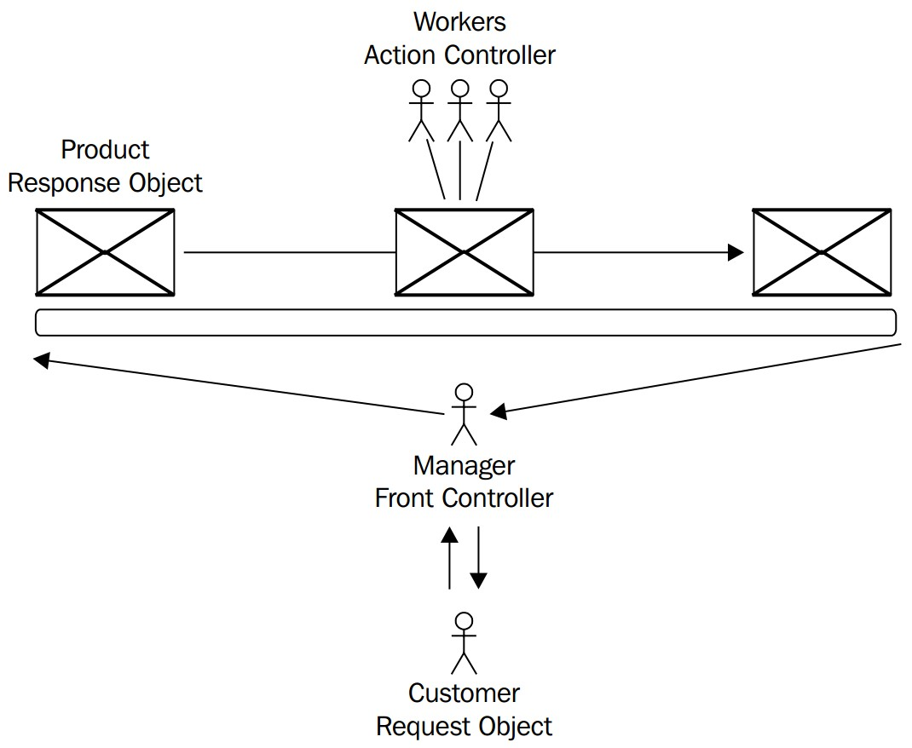
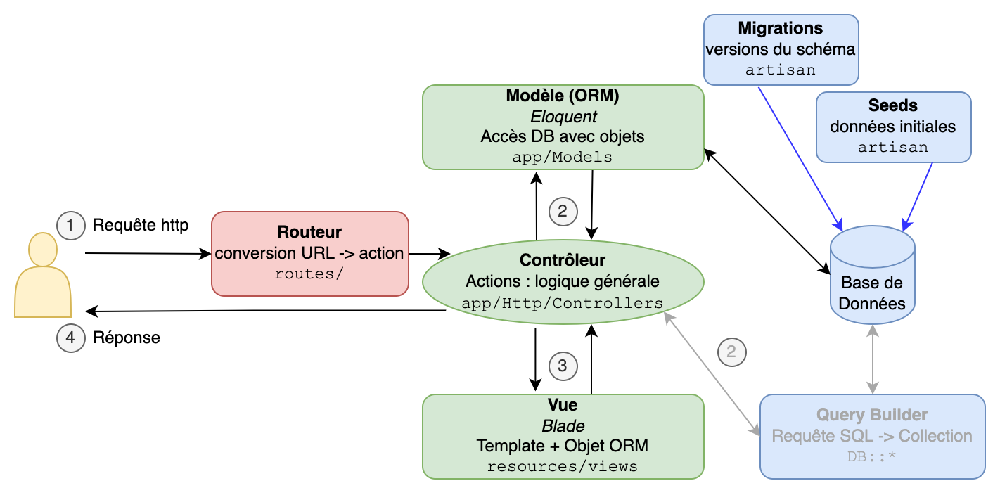

% 03.Laravel

# Développement web il3

## Laravel{.title}

<footer>HE-Arc (DGR & R. Emourgeon) 2018-23</footer>

# Pourquoi [Laravel](https://laravel.com/) ?

* Framework full stack / glue
* Prise en main rapide
* Bonne documentation, grande [communauté][LaraForum]
* Incite au respect des principes [S.O.L.I.D][SOLID]
* Gratuit et opensource (Licence MIT)

# Historique

* Projet initié en 2011 par [Taylor Otwell][TO]
* Basé sur des composants d'autres frameworks
* Mai 2013 : version 4, utilise [composer][Composer]
* Août 2014 : projet PHP le plus [populaire][LaraStats] sur github
* [Qui][builtwith] utilise Laravel ?
* version 9 publiée 08.02.22, v10 : 07.02.23

# Principales fonctionnalités

* Routes RESTful
* ORM (Eloquent, implémentation du pattern Active Record)
* Migrations
* Moteur de templates (Blade)
* Pagination
* Authentification, sessions
* Mail
* Tests unitaires
* Extensible par [packages][Packalyst] (bundles) via composer

# Le Front Controller



# Architecture



# MVC

* Structure d'une appli web = [cycle Requête/Reponse][lifeCycle]
* Modèle : Eloquent ORM
* Vue : Blade Engine
* Contrôleur : hérite de BaseController

# Pratique

* Conventions de codage : Laravel respecte [PSR-2][PSR2]
    * Vous aussi avec [StyleCI][styleci]
* Editeurs et IDE : VSCode (aussi dans github et gitlab avec .) PhpStorm, [phoenix][phoenix], ...
* Tests : unitaires, Jmeter, Selenium, ...
* Outils : devtools Chrome ou FF, [Emmet][emmet], git
* Doc
    * [Documentation officielle][LaraDoc] de Laravel
    * Cheat Sheet [dev.to][devto], [Laravel 8][LaraCheat], [Artisan][ArtisanCheat]
* Tutoriels
    * Pour un tuto à jour : bien préciser la version (12) dans votre recherche
    * Laravel 11 : [Best Momo][tutoBMomo], [Tuts Make][tutsmake], [Plural Sight][tutoCS]

# Environnement de développement
* De quoi ai-je besoin pour développer ?
	* (L)AMP : Serveur HTTP, SGBD, PHP
	* Git
	* [Composer][composer] : gestionnaire de dépendances PHP
	* Associer nom de domaine au dossier projet
* Installer Laravel (créer un nouveau projet)

```bash
$composer global require "laravel/installer"
```

* Le déploiement est simplifié si l'env de **dev** ressemble à celui de **production**

# Environnement de développement
* Local
    * Installation AMP, git + configuration : Long
    * Dépendant du poste de travail
    * Travail offline
* VM (Vagrant - [Homestead][homestead]) ou conteneur
    * Mise en route plus rapide : pré-configuré
    * Environnement dédié au dev, identique pour chaque développeur
* Cloud (koding.com, coder.com, repl.it, gitpod ...)
    * Mise en route plus rapide : pré-configuré
    * Indépendant du poste de travail (navigateur)
    * Outils de synchro disponibles

# Aide à la mise en place du dev env
* Paquets AMP (WAMP, EasyPHP, ...)
* Pour aller plus vite :
	* Windows : [Laragon][laragon]
	* Laravel Valet pour [Mac][valetOSX], [Ubuntu][valetLinux], et [WSL][valetWSL]
* Windows avec WSL
    * [Tuto][wsl1]

# Démarrer un projet
* Créer un nouveau projet

```bash
$ composer create-project laravel/laravel raidit
# ou si ~/.composer/vendor/bin est dans le PATH :
$ laravel new raidit
$ cd raidit
```

* Racine du site dans ``/public`` (lien symbolique ou virtual host)

# Le dépôt

* Initialiser le dépôt

```bash
$cd raidit
$git init
$git add .
$git commit -m "Install laravel"
$git remote add origin git@github.com:bastian/raidit.git
$git push --set-upstream origin master
```

* Penser à ajouter sa clé publique à Github

# Apache

* Virtual hosts
    * `http-vhosts.conf` (activer dans `httpd.conf`)
    * Un par site
    * Pointer dans `/public`
* `AllowOverride` : active `.htaccess`
* `.htaccess` : redirection des requêtes
* Alternative : Remplacer le dossier racine http par un lien symbolique vers le dossier `/public`

# Artisan

* Laravel's CLI
* Construit avec Symfony Console
* Aide aux tâches courantes, ex:

```bash
$php artisan route:list
$php artisan migrate
$php artisan make:controller

$php artisan list
```

* [Extensible][artisan]

# Premiers pas

* [Routes][routing]
    * Ajouter une route `/test`
    * Ajouter un paramètre qui sera affiché : `/test/param`
    * Utiliser une vue pour cette route
    * Lister les routes avec la commande artisan

. . .

* [Contrôleurs][controllers]
    * Ajouter un contrôleur : `Test`
    * Lui ajouter une action : `index`
    * Ajouter la route correspondante : `/test/index`

. . .

* [Vues][views]
    * Ajouter une vue Blade (`.blade.php`)
    * Afficher cette vue dans l'action `index`

# Ressources

* [Tips](https://github.com/LaravelDaily/laravel-tips)
* [Cheat Sheet][hackrCheat]
* [Laracast](https://laracasts.com/search?query=laravel%2011)
* [Learning Laravel](https://learninglaravel.net/tags/tutorials)
* [Laravel 10 REST API CRUD tuto](https://www.tutsmake.com/laravel-10-rest-api-authentication-with-passport/)
* [Les vôtres](https://github.com/HE-Arc/slides-devweb/wiki/Ressources)

[LaraForum]: https://laravel.io/forum
[SOLID]: https://fr.wikipedia.org/wiki/SOLID_(informatique)
[TO]: https://medium.com/@taylorotwell
[Composer]: https://getcomposer.org/
[LaraStats]: https://github.com/search?l=PHP&q=stars%3A%3E0&ref=searchresults&type=Repositories
[builtwith]: https://madewithlaravel.com/
[Packalyst]: https://packalyst.com/
[lifeCycle]: https://laravel.com/docs/master/lifecycle
[PSR2]: https://laravel.com/docs/5.1/contributions#coding-style
[styleci]: https://styleci.io/
[phoenix]: https://phcode.io/
[emmet]: https://emmet.io/
[LaraDoc]: https://laravel.com/docs/master
[devto]: https://dev.to/mikevarenek/laravel-fundamentals-a-cheat-sheet-for-rapid-development-gd9
[LaraCheat]: https://quickref.me/laravel
[ArtisanCheat]: https://artisan.page/
[hackrCheat]: https://hackr.io/blog/laravel-cheat-sheet
[tutsmake]: https://tutsmake.com/?s=laravel+12
[tutoBMomo]: https://laravel.sillo.org/search/laravel%2012
[tutoCS]: https://www.pluralsight.com/paths/laravel
[wsl]: https://docs.microsoft.com/en-us/windows/wsl/install-win10
[homestead]: https://laravel.com/docs/master/homestead
[artisan]: https://laravel.com/docs/master/artisan
[routing]: https://laravel.com/docs/master/routing
[controllers]: https://laravel.com/docs/master/controllers
[views]: https://laravel.com/docs/master/views
[wsl1]: https://jackwhiting.co.uk/posts/setting-up-a-windows-10-development-environment-with-wsl-php-laravel/
[laragon]: https://laragon.org/
[valetOSX]: https://laravel.com/docs/master/valet
[valetLinux]: https://cpriego.github.io/valet-linux/#installation
[valetWSL]: https://github.com/valeryan/valet-wsl

<style type="text/css">
    section.title, section#sources, h1.title {display:none;}
    section#premiers-pas ul li ul li,
    section#pratique ul li  ul li{
    font-size: 70%;  
    }
</style>
