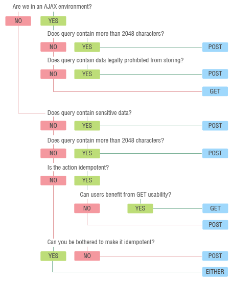

% 06.HTTP & AJAX

# Développement web dlm3

## HTTP & AJAX{.title}

<footer>HE-Arc (DGR) 2017</footer>

# HyperText Transfer Protocol

* Protocole application : invention www en 1990 (v0.9)
	* Connexion, GET, réponse, fermeture
* HTTP 1.0 (1996)
	* Entêtes de requête (Host, Referer, User-Agent, …)
	* Entêtes de réponse (Content-Type, Set-Cookie, Location, …)
* HTTP 1.1 (1997)
	* Keep-alive, pipelining, cache, ...
	* Plus d’entêtes, Host obligatoire
* [HTTP 2.0][1] (2015)
	* Binaire, multiplexage connexions, compresions entêtes, push, ...
	* Supporté par [presque tous][2] les navigateurs, une majorité de serveurs

# Codes de réponse

* 1xx : Information
* 2xx : Succès
* 3xx : Redirection
* 4xx : Erreur Client
* 5xx : Erreur Serveur

# Méthodes HTTP (verbes)

* <span class="green">GET</span> : Demander une ressource
* POST : Création d’une ressource
* <span class="blue">PUT</span> : Remplacement total d’une ressource
* PATCH : Remplacement partiel d’une ressource
* <span class="blue">DELETE</span> : Suppression d’une ressource
* <span class="green">HEAD</span> : Demande l’entête de la réponse, sans la ressource
* <span class="green">TRACE, OPTIONS</span>, CONNECT

<span class="blue">idempotentes</span><br/>
<span class="green">sûres</span>


# Echanges HTTP

* Requête

```html
GET / HTTP/1.1[CRLF]
Host: www.cff.ch[CRLF]
Connection: close[CRLF]
User-Agent: Opera/9.20 (Windows NT 6.0; U; en)[CRLF]
Accept-Encoding: gzip[CRLF]
Accept-Charset: ISO-8859-1,UTF-8;q=0.7,*;q=0.7[CRLF]
Cache-Control: no[CRLF]
Accept-Language: de,en;q=0.7,en-us;q=0.3[CRLF]
Referer: http://web-sniffer.net/[CRLF]
[CRLF]
```

* Réponse

```html
HTTP Status Code: 	HTTP/1.1 302 Found
Date:			Mon, 16 Nov 2009 08:01:35 GMT	
Server:			Apache	
Location:		http://www.sbb.ch/fr/	
Content-Length:		205	
Connection:		close	
Content-Type:		text/html; charset=iso-8859-1

<!DOCTYPE HTML PUBLIC "-//IETF//DTD HTML 2.0//EN">
<html><head><title>302 Found</title>
</head><body>
<h1>Found</h1>
<p>The document has moved <a href="http://www.sbb.ch/fr/">here</a>.</p>
</body></html>
```

# HTTP

* Requête POST : paramètres dans le corps

```html 
POST /login.jsp HTTP/1.1
Host: www.mysite.com
User-Agent: Mozilla/4.0
Content-Length: 27
Content-Type: application/x-www-form-urlencoded

userid=joe&password=guessme
```

* Outils HTTP
	* CLI : curl
	* Browser dev tools
	* WebApp : [HURL][3]
* Exemples PATCH : [mnot][5] , [SOA bits][6]

# AJAX : Historique

* Asynchronous Javascript And Xml
* Buzzword, [Jesse James Garret][7], 2005
* Mise à jour sans rechargement intégral
* Utilisation de [Remote Scripting][8] et de DOM
* Historique de techniques de remote scripting
	* [(i)frames][9]
	* Bibliothèques JS (ex: [JSRS][10])
	* Utilisation des images/cookies (ex: [GIF][11])
	* Applets, Flash, ActiveX, ...
	* <span class="red">XHR : XML HTTP Request</span> (IE5, 1999 pour OWA)
	* Fetch API
	
* Pas obligatoire d'avoir du JS, XML ni d'être asynchrone !

# AJAX

* XHR est devenue la méthode standard
	* Popularisée par Google (GMaps, GMail, ...)
	* Le w3c fait évoluer un [draft][12] depuis 2006
* Principe
	1. Envoi de requête HTTP
	2. La réponse provoque l'éxecution de la fonction de rappel
	3. Le DOM de la page est mis à jour
* Applications
	* GUI ressemblant à des app natives
	* MAJ dynamiques de formulaires, autocompletion
	* Validation avec interrogation du serveur
	* ...

# L'objet _XMLHttpRequest_

* Initiative de Microsoft
	* Composant ActiveX de IE5
	* Adopté par Mozilla 1.0 et Safari 1.2
	* Standardisation W3C en cours
* Requête HTTP en JS
* Fonction de rappel (callback)
* Asynchrone : Non bloquant
* Non standard => différentes implémentations
* Supporté par Chrome, FF, Safari, IE, Konqueror, ...
* Alternative souhaitable si JS désactivé

# XHR en JS

```javascript
var xhr;
function createXMLHttpRequest() 
{
	if (window.ActiveXObject) 
	{
		xhr = new ActiveXObject("Microsoft.XMLHTTP");
	}
	else if (window.XMLHttpRequest) 
	{
		xhr = new XMLHttpRequest();
	}
}
```

* Dans son [contexte][13]

# XHR en jQuery avec _load()_

```html
<!DOCTYPE html>
<html>
<head>
<script src="jquery.js"></script>
<script>
$(document).ready(function(){
  $("button").click(function(){
    $("#div1").load("demo_test.txt");
  });
});
</script>
</head>

<body>
  <div id="div1"><h2>Let jQuery AJAX Change This Text</h2></div>
  <button>Get External Content</button>
</body>
</html>
```

* [Tester][14]
* D'[autres][15] façons de faire

# XHR : propriétés et méthodes

* `readyState, status, onreadystatechange`
* `responseText, responseXML`
* `open (Verbe, URI, async) :`
	* `Verbe` HTTP : "GET", "POST" ou "PUT"
	* `URI` : destinataire de la requête
	* `async` (bool) : `true` = asynchrone, `false` = bloquant
* `send (null | string)` : peut être bloquante
* `setRequestHeader(header, value)`
* `getResponseHeader(string)`
* `abort()`

# Envoi de données

* GET
	* <span class="red">Obtenir des données</span>
	* Longueur URL limitée par le navigateur (2'048 pour IE)
	* Utilise le cache (navigateur, proxy)
	* manipulables par l'utilisateur (bookmarks, partage, ...)
* POST
	* <span class="red">Faire quelque chose</span>
	* Données sensibles
	* Longueur limitée par le serveur (assez large)
	* Utilisation de la méthode send() de XHR
	* Requête Ajax en 2 temps (entête, puis données)
* Cache
	* Client : Construire des [URL uniques][16]
	* Serveur : Envoi d'[entêtes][17] interdisant le cache
	
```javascript
MyXhr.open("GET", "fichier.xml", true);
MyXhr.setRequestHeader("Cache-Control", "no-store, no-cache, must-revalidate, 
			post-check=0, pre-check=0");
MyXhr.setRequestHeader("Pragma", "no-cache");
MyXhr.setRequestHeader("Expires", "Wed, 09 Aug 2000 08:21:57 GMT"); 
```

# Préférer GET, sauf

<div>



</div>

<div style="float:right;">

[Détails][18]

</div>

# Réponse en texte

* Si la requête aboutit :
	* `readystate == 4`
	* `status == 200`
* La réponse est dans l'attribut `responseText`
* ou dans `responseXML`
	* Utilisation du DOM (`getElementsByTagName(), ...`)

# Réponse en XML

```xml
<?xml version="1.0" ?>
<liste>
     <personne>
         <nom>Berger</nom>
         <prenom>Laurent</prenom>
     </personne>
     <personne>
         <nom>Borgo</nom>
         <prenom>Sébastien</prenom>
     </personne>
     <personne>
         <nom>Bux</nom>
         <prenom>Rémy</prenom>
     </personne>
</liste>
```
   * Dans `responseXML`

# Réponse en [JSON][19]

* [Standard][20] depuis octobre 2013 ([Douglas Crockford][21])
* Tableau d'objets js :
	* pour chacun, ses attributs sont des paires clé:valeur

```json
{objet1 : nom : 'Berger', prenom: 'Laurent'}

[objet1, objet2, objet3]

[
	{nom:"Berger", 	prenom:"Laurent"},
	{nom:"Borgo", 	prenom:"Sébastien"},
	{nom:"Bux", 	prenom:"Rémy"}
]
```

* Utilisation de :
`~~var users = eval('(' + myXHR.responseText + ')'); ~~` 
pour créer le tableau d'objets correspondant

# [« eval is Evil »][22]

* `eval()` : évalue et exécute la chaîne en paramètre
* Risque : instructions au lieu d'un tableau d’objets
* Solution : le [parser][23] JSON 

```javascript
var users = JSON.parse(myXHR.responseText);
var myString = JSON.stringify(users);
```
* Avec jQuery : 

```javascript
var obj = jQuery.parseJSON('{"nom":"Berger"}');
alert(obj.nom);
```

# Fetch API

* Le successeur d'XHR est [fetch][whatwg:fetch] : [Exemple][28]
* Fetch a un _polyfill_ pour les navigateurs ne le supportant pas
* L'API Fetch est native et plus simple d'utilisation que jQuery

```javascript
fetch("fichier.json")
    .then(function(response) {
        return response.json()
    })
    .then(function(json) {
        console.log(json);
    })
    .catch(function(error) {
        console.error("erreur", error)
    })
```

* L'API fecth est native et utilise les [promesses][29] plutôt que les callbacks

# Traitement d'erreurs

* Utiliser les [entêtes HTTP][24]
	* Champ Status
	* Code d'erreur
* En PHP

```php
header("Status: Message d'erreur explicite", true, 400);
```

* Afficher le message au client :

```javascript
myXHR.getResponseHeader("Status");
```

# Penser à l'utilisateur !

* Requêtes XHR non enregistrées dans l'historique :
	* Bouton précédent non opérationnel (sauf GET et URL uniques)
	* Pas de bookmark
    * solution via [History API][w3c:history]
* Utilisabilité : signaler à l'utilisateur ce qui est en cours :
	* GIF [AJAX loading][25]
	* Rectangle Loading en haut à droite (Google)
	* [Yellow Fade Technique][26] (37signals) : partie modifiée
* Code client :
	* Pas de maitrise performance
	* Mauvais code == Appli lente
* En cas de doute, faire tester des utilisateurs

# Bonnes pratiques d'utilisabilité

* Trafic minimal
* Pas de surprise
* Respect des conventions
* Pas de distraction
* Accessibilité ([ARIA][27])
* Ne pas switcher AJAX/non-AJAX
* Se mettre à la place de l'utilisateur

<!-- Bibliographie -->
[1]:https://docs.google.com/presentation/d/1eqae3OBCxwWswOsaWMAWRpqnmrVVrAfPQclfSqPkXrA/present#slide=id.p19
[2]:http://caniuse.com/#feat=http2
[3]:http://hurl.it/

[5]:http://www.mnot.net/blog/2012/09/05/patch
[6]:http://soabits.blogspot.ch/2013/01/http-put-patch-or-post-partial-updates.html
[7]:http://web.archive.org/web/20110102130434/http://www.adaptivepath.com/ideas/essays/archives/000385.php
[9]:http://archive.oreilly.com/pub/a/javascript/2002/02/08/iframe.html
[8]:https://en.wikipedia.org/wiki/Remote_scripting
[10]:http://www.ashleyit.com/rs/jsrs/test.htm
[11]:http://web.archive.org/web/20100916110710/http://depressedpress.com/Content/Development/JavaScript/Articles/GIFAsPipe/Index.cfm
[12]:https://www.w3.org/TR/XMLHttpRequest/
[13]:http://www.xul.fr/xml-ajax.html#ajax-exemple
[14]:http://www.w3schools.com/jquery/tryit.asp?filename=tryjquery_ajax_load
[15]:https://code.tutsplus.com/tutorials/jquery-succinctly-jquery-and-ajax--net-33856
[16]:http://stackoverflow.com/questions/367786/prevent-browser-caching-of-jquery-ajax-call-result
[17]:https://developers.google.com/web/fundamentals/performance/optimizing-content-efficiency/http-caching
[18]:http://blog.teamtreehouse.com/the-definitive-guide-to-get-vs-post
[19]:http://www.json.org/
[20]:http://www.ecma-international.org/publications/files/ECMA-ST/ECMA-404.pdf
[21]:http://www.crockford.com/
[22]:https://javascriptweblog.wordpress.com/2010/04/19/how-evil-is-eval/
[23]:https://developer.mozilla.org/fr/docs/Web/JavaScript/Reference/Objets_globaux/JSON/parse
[24]:https://www.bennadel.com/blog/1860-using-appropriate-status-codes-with-each-api-response.htm
[25]:http://www.ajaxload.info/
[26]:https://signalvnoise.com/archives/000558.php
[27]:https://developer.mozilla.org/en-US/docs/Web/Accessibility/ARIA

[w3c:history]: http://w3c.github.io/html/browsers.html#session-history-and-navigation
[whatwg:fetch]: https://fetch.spec.whatwg.org/
[28]:https://developer.mozilla.org/fr/docs/Web/API/Fetch_API/Using_Fetch
[29]:https://www.promisejs.org/

<!-- Hack -->
<style>
	.green {color: green}
	.blue {color: darkblue;}
	.red {color: red;}

	.sourceCode {
    font-size: 80%;
	line-height: 80%;
    margin: 0 auto;
	overflow: hidden; 
  }
  
	#envoi-de-données li {font-size:75%} 
	
	figure img{
	  width: auto;
	  height: auto;
	}
	
	figure {background-color: white;}
  
  
  
</style>
 
