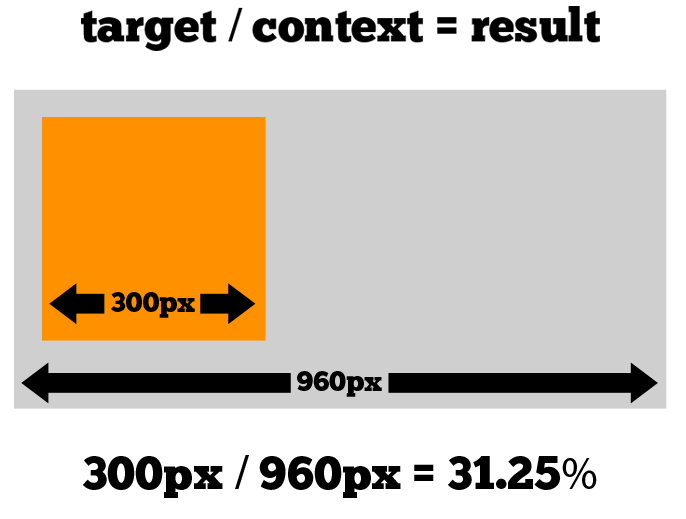

% 10.Responsive Web Design

# Développement web il3

## Responsive Web Design{.title}

### *Conception de sites web adaptatifs*

<footer>HE-Arc (DGR) 2022</footer>

# Site adaptatif ?

* Surfer depuis : PC, mobiles, tablettes, tv, ...
* UX : navigation avec un minimum de zoom, pan, scroll
* S'adapter aux spécifités des appareils
	* orientation
	* taille caractères
	* modes d'interaction (ex: tactile, hover, ...)
	* ...
* 1 seul site à gérer : m.cool.com ni de cool.com/mobile
* Le même contenu pour tous
* Souvent basé sur la largeur de l'écran
* CSS3
* _Responsive Web Design_ [@alistapart:rwd], [Exemple][2]

# Techniques

* Media queries : Taille de l'écran (ou sortie)
* UNITES RELATIVES
* Fonts : Dimensions en em
* Fluid Grids : Disposition et taille des éléments en %
* Flexible images (and media) : Taille des médias en %
* Autres considérations
	* Adaptatif avec [grilles fixes][3]
	* [Performances][4] : tps chargement, requêtes inutiles, ...
	* Transitions CSS
	* ...
* [Exemple][6]

# [Media Queries][7]

* media type : `all, screen, print, tv, braille, handheld, ...`
```html 
<link rel="stylesheet" type="text/css" href="style.css" media="screen" />
<link rel="stylesheet" type="text/css" href="printfriendly.css" media="print" />
```
* media query
	1. dans élément link
	```html 	
	<link rel="stylesheet" type="text/css" media="screen and (max-device-width: 800px)" 
	href="style800.css" />
	```
	2. dans une feuille de style
	```css 	
		#nav {float: right;}
				#nav ul {list-style: none;}
			@media screen and (min-width: 400px) and (orientation: portrait)
				{
						#nav li {float: right; margin: 0 0 0 .5em; border:1px solid #000000;}
				}
			@media screen and (min-width: 800px)
				{
					#nav { width: 200px; }
					   #nav li {float: left; margin: 0 0 0 .5em; border: none;}
				}
	```
	3. Règle CSS import
	```css 
		@import url(style600min.css) screen and (min-width: 600px);
	```

# [Media Queries][7]
```html 
    width, height, device-width, device-height, orientation, aspect-ratio, 
    device-aspect-ratio, color, color-index, monochrome, resolution, scan, grid
```
* Règles CSS selon medium (souvent min-, max-width)
* Opérateurs : only, not, and
* Au moins 3 layouts : mobile, tablet, desktop
* Resolution breakpoints : 320, 480, 600, 768, 1024, 1200px
* Souvent ces règles sont utilisées pour :
	* agrandir la taille du texte
	* agrandir la taille des zones cliquables (utilisation au doigt)
	* faire passer le contenu sur une seule colonne
	* masquer ou afficher des éléments spécifiques
	* ajuster les dimensions et marges
* Attention à l'ordre de chargement

# Meta Tag [viewport][8]

* Introduit pour [iPhone][9], puis standard de fait
	* Par défaut, l'affichage est réduit (980px affichés sur écran 320px)
	* Meta tag viewport permet de changer ce ratio
* viewport : display area ≠ rendering surface
* Mobiles : viewport > écran (iphone 3 : v:980 / é:320)
* Media queries comparent au viewport
* Mise à jour du viewport à la taille de l'écran nécessaire :

```html 
<meta name="viewport" content="width=device-width; initial-scale=1.0">
```

# Résultat = Cible / Contexte


# Texte

* Texte redimensionnable : em pour les polices
* `1rem : font-size:100%` dans élément html (16px/défaut)
* `1em : font-size:100%` dans élément courant
* Conversion px -> em : `result = target/context`
	* ne pas arrondir
	* laisser le rapport en commentaire

# Fluid Grids

* Layout basé sur une grille en pixel
* Conversion px -> % : **result = target/context**
	* ne pas arrondir
	* laisser le rapport en commentaire
* Appliqué au style des divs :

```html
width, margin, padding, background-position, ...
```

# Responsive Images

* Nouveautés de HTML 5
	* Eléments `<picture>`, `<source>`
	* Attributs `srcset` et `sizes`
* [Besoins][10]
	* Écrans haute densité : `srcset`
	* Taille variable : `srcset` et `sizes`
	* [Substitution][11] et modification layout : `<picture>, <source>`
	* Choix formats de fichiers `<picture>`
* [Différences][12] entre `<picture>` et `srcset`
* [Exemple][13] en français

# Flexible images

* Eviter qu'une image ne déborde de son conteneur
	* La réduire
```html 
img, embed, object, video{ max-width: 100%; }
```
	* La découper
```html 
	.feature { overflow: hidden; }
	.feature img { display: block; max-width: auto; }
```
* Pas de standard pour servir différentes tailles de fichier
* Quelques idées recensées par _Smashing Magazine_ [@smashing:rwd]

# Outils

* Tester
	* Simulateur mobile des devtools, largeur browser
	* [bookmarklet][16] pour afficher les media queries
	* mais surtout tester sur mobile
* Et Après ? [MOBILE FIRST][17], [OFFLINE FIRST][18], [PWA][30]
* framework ou from scratch ?

# Références
* Exemples
	* [Site][19] support du [livre][20] d'Ethan Marcotte
	* [mediaqueri.es][21]
	* [thenextweb][22]
	* [designshack][23]
* Plus loin...
	* [Généralités][24]
	* [viewport et media queries][25]
	* D'autres techniques, liste de Smashing magazine [@smashing:rwd]
	* Améliorer la [performance][26]
	* [Making sites more responsive, responsibly][27]
        * Workshop [Pierre Spring][28] 26.02.13
	
# Pratique
* Tester les exemples sur un mobile
* Comprendre les sources
* Présentation adaptative de votre équipe de projet

[2]:https://alistapart.github.io/code-samples/responsive-web-design/ex/ex-site-FINAL.html
[3]:https://blog.atolcd.com/adaptive-design-versus-responsive-design/
[4]:https://browserdiet.com/
[6]:https://webdesignerwall.com/tutorials/responsive-design-in-3-steps
[7]:https://developer.mozilla.org/fr/docs/CSS/Media_queries
[8]:https://blog.javierusobiaga.com/stop-using-the-viewport-tag-until-you-know-ho
[9]:https://developer.apple.com/library/content/documentation/AppleApplications/Reference/SafariWebContent/UsingtheViewport/UsingtheViewport.html
[10]:https://www.smashingmagazine.com/2014/05/14/responsive-images-done-right-guide-picture-srcset/
[11]:https://ericportis.com/etc/smashing-mag-picture-examples/art-direction.html
[12]:https://css-tricks.com/responsive-images-youre-just-changing-resolutions-use-srcset/
[13]:https://www.hteumeuleu.fr/attribut-srcset-images-responsive/
[16]:https://sparkbox.github.io/mediaQueryBookmarklet/
[17]:https://www.lukew.com/resources/mobile_first.asp
[18]:https://offlinefirst.org/
[19]:https://responsivewebdesign.com/robot/
[20]:https://abookapart.com/products/responsive-web-design
[21]:https://mediaqueri.es/
[22]:https://thenextweb.com/dd/2013/01/13/30-new-inspiring-responsive-design-websites/
[23]:https://designshack.net/articles/css/20-amazing-examples-of-using-media-queries-for-responsive-web-design/
[24]:https://johnpolacek.github.io/scrolldeck.js/decks/responsive/
[25]:https://www.quirksmode.org/blog/archives/2010/09/combining_meta.html
[26]:https://csswizardry.com/2013/01/front-end-performance-for-web-designers-and-front-end-developers/
[27]:https://24ways.org/2014/making-sites-more-responsive-responsibly/
[28]:https://www.slideshare.net/caillou/2013-03-webtuesday-responsive
[30]:https://developers.google.com/web/progressive-web-apps/

<!-- Hack -->
<style>

.sourceCode {
    font-size: 76%;
	line-height: 80%;
    margin: 0 auto;
	overflow: hidden; 
  }
  
li p {margin: 5px}
  
</style>
