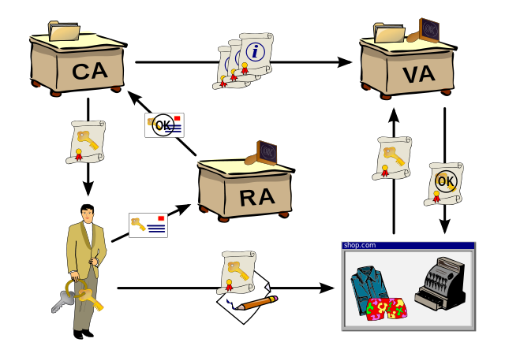

% 11. HTTPS

# Développement web dlm3

## HTTPS{.title}

<footer>HE-Arc (DGR) 2016</footer>

# Sécuriser un site web

* Authentification du serveur
	* Assurer que le serveur est celui qu’il prétend être
* Intégrité des données
	* Assurer que les données reçues sont celles qui ont été envoyées
* Confidentialité des données
	* Eviter que des tiers ne puissent voir les données
* Authentification du client (optionnelle)
	* Assurer que le client est celui qu'il prétend être
* Pour un site web, ces services sont fournis par https
	* HTTPS : HTTP sécurisé par SSL/TLS, par défaut sur le port 443

# Secure Socket Layer --> Transport Layer Security

* Conçu par Netscape (v2.0 en 1994, v3.0 en 1996)
* Brevet racheté par l'IETF : TLS v1.0 en 1999 (SSL 3.1)
* Couche Application :
	* Entre les couches transport et application
	* Pas besoin de modifier la pile TCP/IP
* Possibilité de sécuriser d'autres protocoles :
	* HTTP, SMTP, SIP, ...
* Services offerts :
	* Authentification serveur + intégrité données
	* Confidentialité des données
	* Authentification optionnelle du client
* Certificats (clé publique associée au certificat)

# Rôle d'un certificat
* Garantir le lien entre une entité physique et une entité numérique :
	* Intégrité des données
	* Authentification
	* Confidentialité
* Document contenant une identité et une signature numérique
* Utilisations courantes : https, mails
* Délivré par une autorité de certification
* Certificats clients

# Autorité de Certification
* Tiers de confiance
	* enregistrée et certifiée par des autorités publiques ou de gouvernance de l'Internet
* Rôle :
	* Vérifier et garantir les informations sur l'entité
	* Emettre, délivrer et révoquer les certificats
	* Leur assigner une période de validité
	* Maintenir la liste des certificats valides/révoqués
* Certificats auto-signés :
	* usage interne
	* pas de tiers de confiance

# Contenu d'un certificat X509
* version de X.509 (v3, depuis 1996)
* numéro de série du certificat
* algorithme de chiffrement utilisé pour signer le certificat
* nom de l'AC émettrice
* informations sur la clé publique
* dates de début et fin de validité du certificat
* clé publique du propriétaire du certificat
* signature de l'émetteur du certificat (thumbprint)
* ...

# Composants d'une [PKI][1]
CA : Autorité de certification - VA : Autorité de validation - RA : Autorité d'enregistrement

# Scénario simplifié de connexion HTTPS

1. Le client demande une page sécurisée
2. Le serveur émet sa clé publique et son certificat
3. Le client vérifie la validité du certificat (et qu'il correspond au site)
4. Le client utilise la clé publique pour chiffrer la clé symétrique (CS) utilisée ensuite
5. Le serveur déchiffre cette CS (avec sa clé privée) et l'utilise pour décoder la requête HTTPS
6. Le serveur répond à la requête en chiffrant avec la CS
7. Le navigateur décode la réponse avec la CS

* En [images][2] ou en [slides][3]
* 2-5 en TCP

# Déploiement

* Installer OpenSSL
* (Créer son autorité de certification) si autosigné
* Obtenir le certificat et la clé privée du serveur
* Configurer httpd. Pour Apache :
	* virtual host (port 443), ssl.conf, (ports.conf)
* Création de l'arborescence sécurisée
* Démarrage serveur
* [How to][4]
* OU utiliser un serveur pré-configuré comme [Caddy][16]

# Ressources

* [Security Party 23.10.2009][5]
* [SebSauvage][6]
* Diagramme de séquence [EventHelix][7]
* [HowTo certificats SSL][8]
* [Faux Certificat][8]
* Autorités de certification :
	* [Let's Encrypt][15]
	* [CA Cert][9]
	* [Startcom][10]
	* [Verisign][11] (Symantec)
	* [Thawte][12]
* Différences TLS / SSH : [Snailbook][13], [StackExchange][14]

<!-- Bibliographie -->
[1]:https://en.wikipedia.org/wiki/Public_key_infrastructure
[2]:http://software-engineer-tips-and-tricks.blogspot.ch/2012/08/ssl-in-pictures.html?view=sidebar
[3]:https://www.youtube.com/embed/iQsKdtjwtYI?rel=0
[4]:http://www.vanemery.com/Linux/Apache/apache-SSL.html
[5]:https://wiki.alphanet.ch/Ateliers/PresentationSecurityParty
[6]:http://www.sebsauvage.net/comprendre/ssl/
[7]:http://www.eventhelix.com/realtimemantra/networking/SSL.pdf
[8]:http://www.win.tue.nl/hashclash/rogue-ca/
[9]:http://www.cacert.org/
[10]:http://www.startcom.org/
[11]:https://www.verisign.com/?dmn=www.verisign.ch
[12]:https://www.thawte.com/
[13]:http://www.snailbook.com/faq/ssl.auto.html
[14]:http://security.stackexchange.com/questions/1599/what-is-the-difference-between-ssl-vs-ssh-which-is-more-secure
[15]:https://letsencrypt.org/
[16]:https://caddyserver.com/

<!-- Hack -->

	