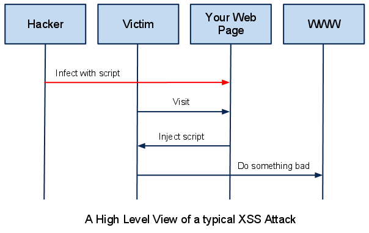
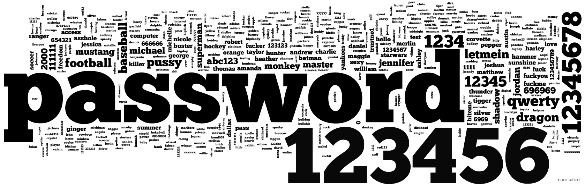
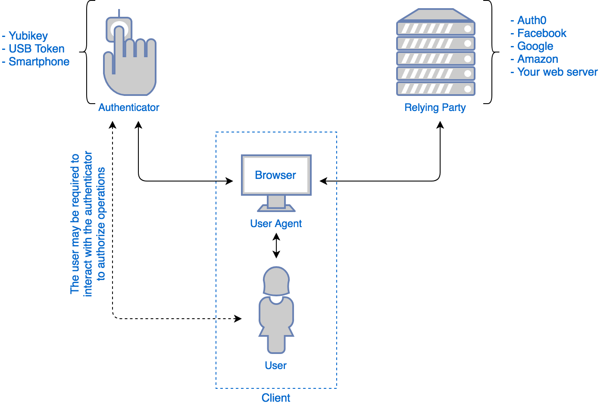
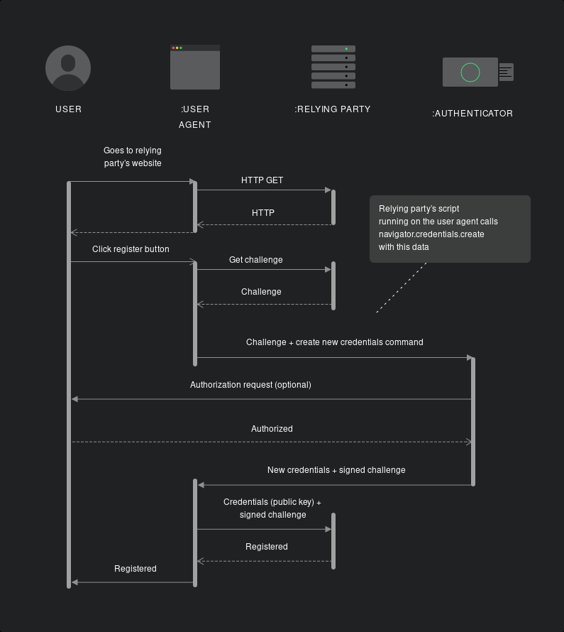
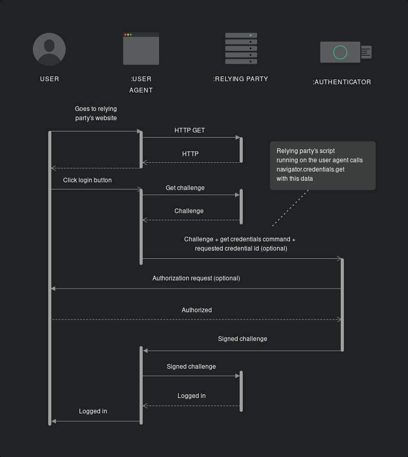

% 12. Risques applicatifs

# Développement web il3

## Risques applicatifs des app web{.title}

<footer>HE-Arc (DGR) 2022</footer>

# Risque
* Faille ou bug permettant d'altérer le fonctionnement
* Un attaquant pourra :
	* Modifier le fonctionnement
	* Accéder ou modifier les données
* Présence possible à tous les niveaux d'un système
	* Application
	* Serveur et Client
	* OS
	* SGBD, ...
* Responsabilité des développeurs :
	* OS, serveurs, langages : patches rapidement disponibles
	* nos applications : **c'est nous qui en sommes responsables**

# [OWASP][26]
* Open Web Application Security Project
* Fondation pour améliorer la sécurité des webapps
* Fondée en 2004, internationale, sans but lucratif
* Référence principale dans le domaine
* Propose :
  * Top 10 (web et [mobile][17]) : [Méthode][40], [CVSS][41], [CWE][42] 
  * Grande communauté d'experts
  * Formation, documentation et ressources
  * Outils d'audit, de tests et de formation

# [Top 10][9] OWASP 2021 ([fr][27] - [historique][30])

1. Contrôle d'accès défaillants
2. Défaillances cryptographiques 
3. Injections
4. Conception non sécurisée
5. Mauvaise configuration de sécurité
6. Composants vulnérables et obsolètes
7. Identification & Authentification de mauvaise qualité
8. Manque d'intégrité des données et du logiciel
9. Carences des systèmes de contrôle et de journalisation
10. Falsification de requêtes côté serveur

* Non exhaustif : ex. : risques liés à [Node JS][16]

# Injection de code
* Données mal validées : possibilité d'exécuter du code
* Passées par requêtes :
	* formulaires
	* URL
	* ...
* Type de code injectable : TOUS !
	* HTML
	* SQL
	* Javascript
	* ...

# Injections SQL

* Modifier les requêtes envoyées au SGBD
* Obtention d'un résultat non prévu par le développeur
* Deviner la structure du code pour l'exploiter
* SQL est puissant : UNION, INTO DUMPFILE, ...

[Exemples][1]

```sql
SELECT titre, num FROM livres WHERE num=2 UNION
SELECT login, password FROM user INTO DUMPFILE 'www/exploit.txt'
```

# Eviter les injections SQL

* N'accepter que des caractères valides
* A défaut, neutraliser les caractères dangereux
* Utiliser les entités HTML
* Vérifications strictes dans le code
* Eviter les noms prévisibles pour une appli critique

# Cross Site Scripting (XSS)

* Injection de code (html et script)
* Exécution par le navigateur du client


# Cross Site Scripting (XSS)

* Enjeux : tout ce qui est possible en JS
	* Redirection
	* Lecture de cookies (session, ...)
	* Envoi d'info à un autre serveur
	* Modification du contenu de la page
	* ...
* Souvent utilisé pour transmettre le cookie de session

```html

```

# 3 types de XSS

* Reflected XSS
	* Affichage d'une partie de la requête (recherche, erreur, ...)
* Stored XSS
	* Stockage dans la BDD et affichage (= exécution) par plusieurs clients
* DOM based XSS
	* Exécutée lors de la modification du DOM ([Exemple][2])

# Cross Site Request Forgery (CSRF - Sea Surf)

* **Principe** :
	* Faire réaliser à quelqu'un une action à son insu, avec ses propres infos d'authentification (credentials)
* Envoi par mail ou post forum de liens ou images
* Les URL correspondent à actions (vote, suppression, ...)

[Exemple][3] (SOP, CORS)

# Phishing

* Site sosie d'un site officiel :
	1. L'utilisateur saisit ses données...
	2. ... l'attaquant les récupère...
	3. ... et les utilise sur le site officiel
* Difficile à contrer pour le développeur
* L'utilisateur doit être prudent
* Bien lire les URLS et le GUI du navigateur pas toujours suffisant
* Ne pas utiliser de lien dont on n'est pas sur de la source ([Homograph Attack][4], [Homoglyphes][38], [Unicode Spoofing][39])

# Risques non liés à l'application

* IoT : souvent mal sécurisé ([shodan.io][20])
* DoS
* Spoofing (IP, DNS, ARP)
* Buffer Overflows (surtout en C)
* Trojans, backdoors
* Usurpation de mots de passe : dictionnaire, force brute
* **SOCIAL ENGINEERING !!!**

# Authentification

* **Identification** : annoncer qui on est
* **Authentification** : prouver qu'on est la personne qu'on prétend être :
  1. Avec quelque chose que l'on **sait** (PIN, mot de passe)
  2. Avec quelque chose que l'on **possède** (téléphone, token, ...)
  3. Avec quelque chose que l'on **est** (biométrie)
* La sécurité augmente si on combine ces facteurs
* Important de prendre en compte l'utilisabilité 

# Top 500 passwords cloud


# Mots de passe
* 30% of users have a password from the top 10'000 ([source][5])
* Our passwords habits [revealed][19]
* xkcd's [password strength][6]
* 2017 : [NIST 800-63-3][21] suivi par la [NCSC][22]
	* Mots de passe longs plutôt qu’avec des caractères spéciaux
	* Ne forcer le changement qu’en cas de nécessité
	* Autoriser et accompagner l’utilisation de password managers
	* Utiliser la 2FA
* Plusieurs tentatives pour s'en affranchir :
	* [Microsoft][28], [passwordless][7] authentication
	* 2022 : Passkeys : JS API [WebAuthN][24] + CTAP/[U2F][25]

# [Passkeys][35]
* Paire de clés asymétriques au lieu d'un mot de passe
* Initiative de l'alliance [FIDO][33]
* Fin 2022 : intégrée à Android, iOS, win11 et MacOS 
* Résolution de challenges : pas d'info sensible sur le réseau
* 3 acteurs : 
  * User Agent : Humain / Navigateur
  * Relying Party : Serveur (service auquel on veut s'authentifier)
  * Authenticator : Clef USB / Smartphone / OS + biométrie
* Communication :
  * User Agent <=> Authenticator : CTAP / U2F
  * User Agent <=> Relying Party : API JS [WebAuthn][34]

# Passkeys : [Acteurs][31]


# Passkeys : [Enregistrement][32]


# Passkeys : [Authentification][32]


# Collecte d'information
* Toute information est bonne pour l'attaquant
	* Messages d'erreur
	* Configuration OS serveur
	* Configuration serveurs (http, sql, php, ...)
	* Identifiants et commentaires dans sources -au cas où-
	* SOCIAL ENGINEERING !
* Le développeur doit laisser filter un minimum d'info !
* Utilisée aussi par les "white hats" (ethical hackers) : [Honeypots][8]

# Bonnes pratiques
* Configuration stricte du serveur
* Valider toutes les entrées (formulaires, requêtes HTTP)
* Filtrage/encodage de toutes les entrées en entités HTML
* Ne jamais afficher directement une saisie de formulaire
	* Ni aucune donnée transmise par HTTP avant de l'avoir filtrée !
* Tester ses formulaires avec des expressions à risques
* Contrôler le maximum de paramètres (même si redondant) :
	* Session, IP, user agent, proxy, ...
* Utiliser un framework 
	* ces bonnes pratiques sont déjà implémentées
* Suites et logiciels de test

# Références

* Référence
	* [OWASP][10], [webinar fr 2016][29]
	* WebAuthn : [w3c][36], [MDN][37]
* Exemples, explications
	* [Présentation XSS et CSRF][11] en français
	* [Protection CSRF][12] en français
* Utilitaires, tutos, exercices
	* [Web Goat][13]
	* [Insecure Labs][14]
	* [Google-Gruyere][15]

<!-- Bibliographie -->
[1]:https://fr.wikipedia.org/wiki/Injection_SQL
[2]:https://www.owasp.org/index.php/DOM_Based_XSS
[3]:https://www.owasp.org/index.php/CSRF
[4]:https://www.xudongz.com/blog/2017/idn-phishing/
[5]:https://mojoauth.com/blog/why-are-businesses-still-using-passwords/
[6]:https://xkcd.com/936/
[7]:https://hacks.mozilla.org/2014/10/passwordless-authentication-secure-simple-and-fast-to-deploy/
[8]:https://hackertarget.com/cowrie-honeypot-analysis-24hrs/
[9]:https://www.owasp.org/index.php/Category:OWASP_Top_Ten_Project
[10]:https://www.owasp.org/index.php/Main_Page
[11]:https://www.journaldunet.com/developpeur/tutoriel/php/031030php_nexen-xss1.shtml
[12]:https://www.apprendre-php.com/tutoriels/tutoriel-39-introduction-aux-cross-site-request-forgeries-ou-sea-surf.html
[13]:https://www.owasp.org/index.php/Webgoat
[14]:https://www.insecurelabs.org/task
[15]:https://google-gruyere.appspot.com/
[16]:https://cheatsheetseries.owasp.org/cheatsheets/NPM_Security_Cheat_Sheet.html
[17]:https://owasp.org/www-project-mobile-top-10/
[18]:https://www.owasp.org/images/5/57/OWASP_Proactive_Controls_2.pdf
[19]:https://visual.ly/our-password-habits-revealed
[20]:https://www.shodan.io/
[21]:https://nakedsecurity.sophos.com/2016/08/18/nists-new-password-rules-what-you-need-to-know/
[22]:https://www.ncsc.gov.uk/guidance/password-guidance-simplifying-your-approach
[23]:https://www.acunetix.com/blog/articles/xml-external-entity-xxe-vulnerabilities/
[24]:https://en.wikipedia.org/wiki/WebAuthn
[25]:https://u2f-key.tech/fr/
[26]:https://owasp.org/
[27]:https://owasp.org/Top10/fr/
[28]:https://www.microsoft.com/security/blog/2021/09/15/the-passwordless-future-is-here-for-your-microsoft-account/
[29]:https://www.youtube.com/watch?v=pHI2zitLph8
[30]:https://www.hahwul.com/cullinan/history-of-owasp-top-10/
[31]:https://auth0.com/blog/introduction-to-web-authentication/
[32]:https://www.freecodecamp.org/news/intro-to-webauthn/
[33]:https://fidoalliance.org/members/
[34]:https://webauthn.guide/
[35]:https://medium.com/webauthnworks/introduction-to-webauthn-api-5fd1fb46c285
[36]:https://www.w3.org/TR/webauthn/
[37]:https://developer.mozilla.org/en-US/docs/Web/API/Web_Authentication_API
[38]:https://github.com/codebox/homoglyph/blob/master/raw_data/char_codes.txt
[39]:https://onlineunicodetools.com/spoof-unicode-text
[40]:https://owasp.org/Top10/#methodology
[41]:https://www.first.org/cvss/calculator/3.0
[42]:https://cwe.mitre.org/top25/archive/2022/2022_cwe_top25.html

<!-- Hack -->
<style>

	.sourceCode {
    font-size: 80%;
	line-height: 80%;
    margin: 0 auto;
	overflow: hidden; 
  }
figure 			{ background-color: white;}
figure > img 	{height: inherit; width:auto;}   
figure img      {display: flex; justify-content: center; margin: auto; position: relative;}
ol > li {
	margin: 10px 30px;
	font-size: 80%;
}  
  
</style>
